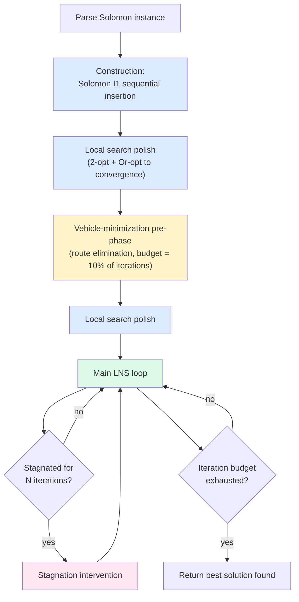
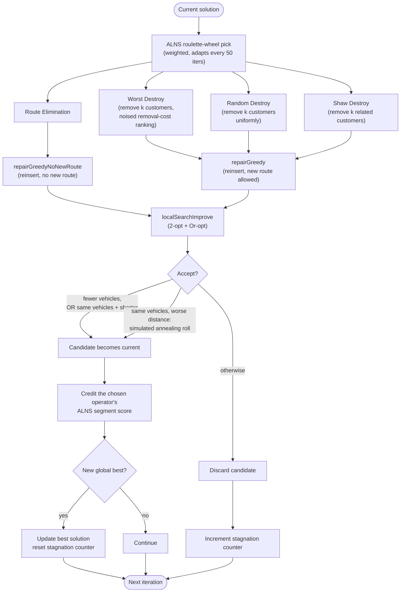

# RoutingOpt

A Large Neighborhood Search (LNS) solver for the Vehicle Routing Problem with Time Windows
(VRPTW), written in Go, compiled to WebAssembly, and run entirely client-side in a browser Web
Worker. No backend, no cloud inference — the whole optimization runs on whatever machine has the
tab open.

This document is for anyone with an operations-research background who wants to understand the
algorithm, poke holes in it, or fork the repo and improve it. It describes the *solver design*,
not the web app plumbing — see [CLAUDE.md](CLAUDE.md) for the engineering/architecture side (WASM
build pipeline, Web Worker internals, LKH3 vendoring, deployment).

**Live demo:** https://ajayarn.github.io/RoutingOpt/ (deploys from `main`; this document describes
the `result-improvement` branch, which only removes dead code and fixes non-algorithmic bugs on
top of `main` — the LNS/construction/LKH3 logic itself is identical between the two, so the demo
reflects everything described below regardless of merge status)
**Solver source:** [`solver/main.go`](solver/main.go) (~2000 lines, single file, no external Go
dependencies)

## Problem

Standard Solomon-format VRPTW: a depot, a set of customers each with `(x, y)`, `demand`,
`[readyTime, dueDate]`, and `serviceTime`, and a fleet of identical vehicles with a fixed
`capacity`. A route is feasible iff:

- **Capacity**: total demand on the route ≤ vehicle capacity
- **Time windows**: at every customer, `arrival + waiting ≤ dueDate` (arriving early just means
  waiting until `readyTime`; arriving after `dueDate` is infeasible, no soft violations)

The objective is **hierarchical / lexicographic**:

1. Minimize the number of vehicles (routes) used
2. Subject to (1), minimize total distance (Euclidean, double precision)

This is the standard formulation for the Solomon/Homberger 100-customer benchmark set, and it's
what every acceptance/comparison decision in this solver is keyed on — a solution with fewer
vehicles is *always* preferred over one with more, regardless of distance.

Every route the solver ever produces is validated against both constraints before it's accepted
anywhere — see [Feasibility](#feasibility) below. There is no soft-penalty relaxation anywhere in
the Go code; the one place a soft-penalty model *is* in play (LKH3) is explicitly walled off and
re-validated (see [LKH3 sub-solver](#lkh3-sub-solver-optional)).

## Pipeline overview



Every stage after construction only ever *keeps* a candidate solution if it is feasible and at
least as good under the hierarchical objective — nothing downstream can make the solution worse
in a way that survives.

## Construction: Solomon I1 sequential insertion

`buildInitialSolution` (Solomon, 1987) — no clustering pre-step. Routes are built one at a time
from the full unrouted pool:

1. **Seed** the route with the unrouted customer farthest from the depot (`selectSeedCustomer`).
2. **Fill** the route by repeatedly picking, among all unrouted customers, the one that maximizes
   a two-part insertion criterion:
   - **c1** (`i1c1`): for a given customer and candidate route, the cheapest feasible insertion
     position, scored by an incremental-distance + time-window-shift measure, minimized over
     positions.
   - **c2**: `λ · distance(depot, customer) − c1`, maximized over customers — this is a *regret*
     term that prioritizes customers far from the depot when there's a choice, since those are
     the ones most likely to become infeasible-to-insert if left for a later, farther-away route.
     `λ = 2.0` (`i1Lambda` in the code), a fixed constant rather than tuned per instance.
3. Repeat until no unrouted customer fits feasibly anywhere in the route (checked via
   `calculateRouteDetails`, the same hard feasibility function used everywhere else), then close
   the route and start a new one with a fresh seed.

No customer is ever pre-assigned to a cluster/route by geography before insertion — a customer
that doesn't fit the current route remains eligible for *any* later route. On the Solomon C101
benchmark this produces a feasible initial solution well under the naive-nearest-neighbor baseline
of ~28 routes / ~2806 distance; see [Results](#results) for what the full pipeline achieves.

## Local search: 2-opt + Or-opt to convergence

`localSearchImprove` alternates two intensification operators until a full round of both produces
no further distance improvement (or a 5-round cap is hit):

- **2-opt** (`twoOptRoute`, intra-route): standard edge-pair reversal to remove crossing edges
  within a single route.
- **Or-opt** (`orOptImproveSolution`, cross-route): relocates short customer segments between
  routes.

These are run alternately, not just once each, because a move from one can re-open an opportunity
for the other — an Or-opt relocation can leave a route in a shape 2-opt can now untangle further,
and vice versa. This runs after construction, after the vehicle-minimization pre-phase, and after
every accepted destroy/repair candidate in the main loop.

## Vehicle-minimization pre-phase

Because the objective is hierarchical (vehicles first), and the main LNS loop below spends most of
its effort on distance, there's a dedicated pre-phase (`runVehicleMinimizationPrePhase`) that tries
to shed routes *before* the main loop starts, while the solution is still "loose" from construction
and hasn't been locked into a tight, hard-to-restructure distance-optimized shape yet. Budgeted at
10% of the total `-iterations`.

The core primitive is **route elimination** (`tryRouteElimination` → `eliminateOneRoute`):

1. Rank routes by "easiest to eliminate" (fewest customers, then lowest total demand —
   `selectWeakestRoutes`).
2. For each candidate route (up to a small `maxAttempts`), evict all its customers
   (`destroyRouteElimination`) and try to reinsert them into the *other* routes only —
   `repairGreedyNoNewRoute` never opens a new route, so success here is a genuine vehicle-count
   reduction.
3. **If the direct reinsertion fails** (measured on the R204 instance: this happens 200/200 times
   once routes are near the capacity-lower-bound fleet size — "no slack anywhere in either fixed
   survivor order" is a real structural dead end, not bad luck), fall back to also freeing a random
   slice of the *survivors'* own customers back into the same repair pass, giving the search room
   to reshuffle both sides at once instead of inserting into an immovable skeleton
   (`routeEliminationShuffleBudget = 5` retries).
4. Stop when vehicle count hits the capacity lower bound (`minVehiclesLowerBound` — a closed-form
   bin-packing bound: `⌈total demand / capacity⌉`, which time windows can only push up from, never
   below), the budget is exhausted, or `vehicleMinMaxConsecutiveFailures = 10` attempts in a row
   fail at the same vehicle count (a stuck partition should defer to the main loop's broader
   destroy/repair to reach a *different* customer-to-route split, rather than burn the whole budget
   retrying a proven dead end).

Route elimination is *also* available as a destroy operator inside the main loop (below) — the
pre-phase just runs it up front, unconditionally, before distance optimization narrows the search.

## Main LNS loop



Each iteration: pick a destroy operator → destroy → repair → local-search polish → accept/reject
→ credit the operator → check stagnation. `k` (customers removed per iteration, for Worst/Random/
Shaw) is drawn uniformly from `[max(2, 5% of customers), max(5, 30% of customers)]` each iteration.

### Destroy operators - adaptive (ALNS) selection

Rather than a fixed split, which operator fires each iteration is chosen by roulette wheel over
weights that adapt to what's actually been productive on *this* instance (`alnsWeights`, following
Ropke & Pisinger's adaptive large neighborhood search scheme): every operator starts at weight 1.0;
each iteration's chosen operator is credited a score based on its outcome (new global best > tied-
vehicle improvement > accepted-but-worse > nothing for a rejected candidate); every 50 iterations,
weights are updated from each operator's average score that segment (`w = w·(1−r) + r·avgScore`,
reaction factor `r = 0.2`), floored so a bad segment can't zero an operator out permanently. An
operator that wasn't tried at all that segment keeps its weight unchanged - only firing-but-
unproductive is penalized, never being unlucky enough not to get picked.

| Operator | Mechanism |
|---|---|
| **Route Elimination** | Same primitive as the pre-phase — try to empty one whole weak route into the others. |
| **Worst Destroy** | Remove the `k` customers whose removal saves the most route distance (`destroyWorst`), with random noise added to the ranking so it isn't perfectly greedy every time. |
| **Random Destroy** | Remove `k` uniformly random customers (`destroyRandom`). |
| **Shaw Destroy** | Remove a *related* cluster of `k` customers (`destroyShaw`) - see below. |

**Shaw (relatedness-based) removal** (Shaw, 1997; the weighted-term formulation is Ropke &
Pisinger's): grows a removal set by repeatedly picking, from a random already-removed "anchor"
customer, the most-related still-routed customer, where relatedness (`customerRelatedness`)
combines - each normalized to [0,1] by the instance-wide maximum, then weighted - geographic
distance (weight 9, dominant), difference in *current-solution* arrival time (weight 3, not the
raw time-window bounds), and demand difference (weight 2). Selection isn't purely greedy: a
"determinism parameter" (`shawRandomization = 6`, `y = roll^6` biasing toward but not forcing the
single most-related candidate) keeps it from being deterministic. The intent, unlike Worst/Random
removal, is a removal set a repair pass can plausibly re-cluster onto one route.

### Repair

**Greedy insertion** (`repairGreedy`): each removed customer is reinserted at its single cheapest
feasible `(route, position)` across all existing routes, or into a brand-new route if nothing
fits. Route Elimination candidates instead go through `repairGreedyNoNewRoute` (same greedy
insertion, but a new route is never opened — that would defeat the point of trying to eliminate
one).

### Acceptance criterion - simulated annealing, bounded by the hierarchical objective

- Always accept if the candidate uses **fewer vehicles** - this can never be overridden by
  temperature; a worse-vehicle-count candidate is rejected outright regardless of how "hot" the
  schedule is, keeping the hierarchical objective intact.
- Otherwise accept if vehicle count is unchanged and **distance improved**.
- Otherwise, within a **tied vehicle count**, accept a worse-distance candidate with Metropolis
  probability `exp(-Δ/T)` (`simulatedAnnealingAccept`), where `Δ` is how much worse the distance
  is and `T` cools geometrically from `5%` of the constructed solution's total distance down to
  `1%` of that starting value by the final iteration. This applies uniformly across every destroy
  operator, not just one of them.

### Stagnation intervention

If `stagnationCounter` (consecutive non-improving iterations) reaches `-stagnation-threshold`
(default 20), a heavier intervention fires:

1. **Select routes to destroy** (`selectStagnationRoutesHeuristically` → `mostRelatedRoutes`):
   rather than a random or worst-distance pick, this treats each route as a single synthetic
   "customer" at its centroid (reusing `customerRelatedness`, the same scoring Shaw removal uses)
   and preferentially selects the most *related* routes - not just geographically close ones, but
   ones visited at similar times in the current solution and carrying similar demand. Two routes
   that overlap in space but serve very different parts of the working day, or wildly different
   loads, are now treated as less related than pure centroid distance alone would suggest - the
   property this replaced a plain nearest-centroid sort to get.
2. **Re-solve the freed customers as a subproblem**, via either:
   - the **pure-Go sub-solver** (default): I1 construction on just the destroyed customers, then
     50 sub-iterations of a small destroy/repair LNS on that subset, then a local-search polish; or
   - **LKH3** (`-use-lkh`), see below.
3. **Merge** the resolved subproblem's routes back with the untouched routes, and accept the merge
   only if it improves on the pre-intervention best.
4. If it doesn't improve, retry up to `maxAttempts = 3` times with different candidate routes
   (destroy-route selection excludes previously-tried combinations via a `history` list) before
   giving up and reverting to the pre-intervention solution.

### LKH3 sub-solver (optional)

`-use-lkh` swaps step 2 above for a call into [LKH3](http://webhotel4.ruc.dk/~keld/research/LKH-3/)
— a specialized, decades-refined TSP/VRP local-search solver — compiled either as a native binary
(CLI use) or to WebAssembly (browser use, via a small pool of pre-instantiated module instances;
see CLAUDE.md's "Client-side execution" section for why a pool).

Two things make this safe to bolt onto a hard-constraint solver even though **LKH3 internally uses
a soft violation-penalty model, not hard constraints**:

- **A hard vehicle cap.** Unlike the pure-Go sub-solver (which can always open a new route),
  LKH3's `VEHICLES` parameter is a hard partition cap. Before falling back to using exactly as
  many vehicles as were destroyed, the solver **probes `vehicles − 1`** on the first attempt of
  each stagnation trigger (`shouldProbeLKHMinusOne`) — if LKH3 can partition the destroyed
  customers into one fewer vehicle, that's a genuine, cheap vehicle-count reduction discovered
  essentially for free.
- **Zero trust in the output.** Every route LKH3 returns is re-run through
  `calculateRouteDetails` — the identical hard feasibility check every other part of the file
  uses — before it's allowed anywhere near the accepted solution. If validation fails for even one
  route, the entire LKH3 result for that call is discarded and the pure-Go sub-solver runs
  instead. LKH3 can never be the reason an infeasible solution reaches the output.

## Feasibility

`calculateRouteDetails(customerIDs, customers, depot, capacity) (Route, bool)` is the single
feasibility oracle every operator in the file goes through — construction, every destroy/repair,
every local-search move, and every LKH3-sourced route. It computes arrival/wait/departure times
and load in one pass and returns `ok=false` on the first capacity or time-window violation. There
is no other path by which a route enters a `Solution`. This is the property that makes it safe to
bolt a soft-penalty external solver (LKH3) onto an otherwise hard-constraint system.

## Results

Both instances below were run under identical conditions (`-iterations 2000`, `-seed 42`, no
`-use-lkh`) so the comparison across rows is genuinely apples-to-apples, unlike an earlier version
of this table that mixed a short C101 run with a long LKH-assisted R204 run:

| Instance | Best known | This solver | Gap |
|---|---|---|---|
| C101 (clustered, loose time windows) | 10 vehicles / 828.94 | 10 vehicles / 828.94 | 0.00% |
| R204 (random, wide time windows, 2-vehicle capacity-bound) | 2 vehicles / 825.52 | 2 vehicles / 861.24 | 4.33% |

The C101 number is not a hardcoded target: best-known values live only in the frontend's display
table (`BEST_KNOWN_SOLUTIONS` in `src/App.tsx`) for showing the gap in the UI, and are never passed
into the solver — there is no early-stop-at-optimal feature anywhere in `solver/main.go`. C101's
loose time windows and clustered layout make it a genuinely easy instance for I1 + LNS to reach
optimality on — R204 (2-vehicle capacity bound, wide time windows) is a much harder search space,
hence the visible gap. See [`R204_IMPROVEMENT_REPORT.md`](R204_IMPROVEMENT_REPORT.md) for a full
session log from before this pass's algorithm changes.

**Before/after this pass's algorithm changes** (Shaw removal, ALNS adaptive weighting, simulated
annealing, relatedness-aware stagnation selection), same exact run condition:

| Instance | Before | After | Change |
|---|---|---|---|
| C101 | 10 vehicles / 828.94 (33.0s) | 10 vehicles / 828.94 (27.9s) | no change (already optimal) |
| R204 | 2 vehicles / 870.86 (601s) | 2 vehicles / 861.24 (454s) | **1.10% shorter distance, 24% faster** |

R204 - the harder of the two instances in this repo's own testing - got measurably better *and*
faster from the same iteration budget, which is the result these changes were made for: C101 was
already solved, so there was nowhere for the new operators to show their value; R204's tighter
capacity bound and wider time windows are exactly the kind of harder search space a relatedness-
aware removal operator and an adaptive operator mix should help with most.

Results were not run in this pass across the full 56-instance Solomon/Homberger set bundled in
`public/data/` — that would be a natural next step for anyone forking this to benchmark
systematically.

## Known limitations / places to improve

This is deliberately not a from-the-literature textbook ALNS implementation, and there are still
several places where a more principled approach would likely do better. Listed roughly in the
order an OR practitioner would probably want to attack them:

- **ALNS reward/reaction-factor constants are hand-picked, not tuned.** The segment length (50),
  reaction factor (0.2), and reward ratios (15/5/1 for new-best/improved/accepted) are reasonable
  defaults, not the result of any tuning sweep on this instance set - if the operator mix looks
  wrong on a given instance (e.g. Shaw Destroy's weight collapsing to the floor early), this is the
  first place to look.
- **Shaw removal's relatedness weights (9/3/2 for distance/time/demand) are fixed**, following the
  literature's typical distance-dominant ratio rather than being tuned per instance - R1/RC1
  instances with tighter time windows might benefit from weighting the time term more heavily.
- **LKH3 WASM pool exhaustion has a defensive mitigation, not a root-cause fix.** After 5
  consecutive sub-solve failures/exhaustions, the pool is torn down and rebuilt from scratch rather
  than being left permanently stuck - this bounds the damage (LKH keeps getting used again later in
  the run instead of falling back to pure-Go for the rest of it) but the underlying intermittent
  Emscripten-level failure that causes exhaustion in the first place is still unexplained. See
  CLAUDE.md's "Client-side execution" section.
- **Multi-start is sequential only, and native-CLI-only.** `-restarts N` runs N independent
  trajectories (seed, seed+1, ...) one after another and keeps the best - useful for squeezing a
  better answer out of a fixed wall-clock budget on the CLI, but it's not real parallelism (no
  wall-clock speedup) and the browser worker never passes it. True parallel multi-start in the
  browser would mean multiple Web Workers each running an independent WASM instance - architecturally
  the same shape as the LKH pool, not a quick addition.
- **Only Euclidean, static-instance VRPTW.** No support for asymmetric distances, multiple depots,
  heterogeneous fleets, or dynamic/online arrivals — matches the Solomon benchmark's scope, but is
  worth knowing if you're evaluating this against a different problem class.

## Running it locally

```bash
./build_solver.sh
./solver_bin -file public/data/c101.txt -iterations 1000
```

Flags: `-file` (Solomon instance path, required), `-iterations` (LNS iteration budget, default
1000), `-seed` (RNG seed, default 42), `-stagnation-threshold` (stagnation trigger threshold,
default 20, `0` disables it), `-use-lkh` (enable the LKH3 sub-solver, default `false`, requires
`lkh_bin` — see `./build_lkh.sh`), `-restarts` (native CLI only - run N independent sequential
solves with seed, seed+1, ..., keeping the best; default 1, and the browser worker never passes
anything else). Output is one JSON object per line on stdout: `start`/`progress`/`result`/`error`
messages, the same protocol the browser Web Worker consumes.

Go unit tests (`solver/*_test.go`) cover construction correctness (every customer routed exactly
once, feasibility, determinism under a fixed seed), local search (never worsens, never drops
customers), route elimination (vehicle-count reduction, no customer-ID aliasing bugs), the ALNS
weight update mechanics, the Shaw-removal relatedness scoring (including a statistical check that
it actually groups related customers far more often than chance), the simulated-annealing
acceptance probability, and the stagnation/LKH decision helpers:

```bash
cd solver && go test ./...
```

`public/data/` bundles all 56 Solomon/Homberger 100-customer benchmark instances (c1/c2/r1/r2/
rc1/rc2 series) if you want to benchmark against something other than C101/R204.

## Contributing

Forks and PRs welcome, especially ones that:

- Tune the ALNS segment length / reaction factor / reward ratios and the Shaw relatedness weights
  against a real benchmark sweep, rather than the hand-picked defaults currently in place
- Root-cause the LKH3 WASM pool exhaustion bug, rather than the current tear-down-and-recreate
  mitigation
- Add real parallel multi-start (multiple Web Workers in the browser; goroutines with independent
  `*rand.Rand` instances natively)
- Run and publish a full 56-instance benchmark comparison

See [CLAUDE.md](CLAUDE.md) for the build/deploy pipeline (Go → WASM, LKH3 vendoring and its
Emscripten linking workaround, GitHub Pages deploy) if your change touches anything beyond
`solver/main.go` itself.
